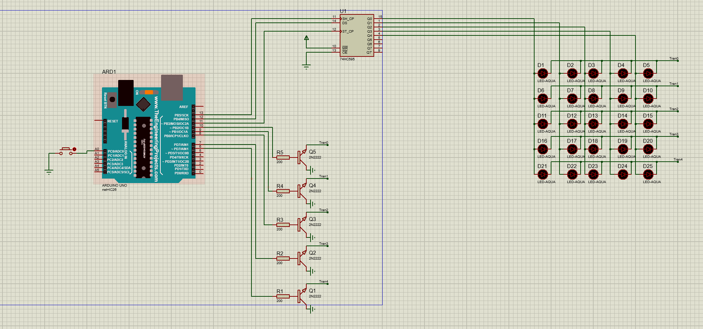

# Led_matrix5x5
thư viện về các animation của led_matrix_5x5 và ví dụ 

# Mạch Hiển Thị LED Ma Trận

## Tổng Quan

Mã nguồn này điều khiển hệ thống hiển thị gồm hai ma trận LED 5x5 sử dụng Arduino. Hệ thống sử dụng shift register để điều khiển các LED và cung cấp nhiều hiệu ứng animation cùng khả năng hiển thị văn bản.

## Yêu Cầu Phần Cứng

- Board Arduino (ví dụ: Arduino Uno, Nano)
- Hai ma trận LED 5x5
- Shift register (74HC595)
- Điện trở và các linh kiện đấu nối

## Cấu Hình Chân

```cpp
#define SH_PIN 13  // Shift Clock (SH)
#define DS_PIN 12  // Data Serial (DS)
#define ST_PIN 11  // Storage Clock (ST)

// Cấu hình chân hàng
int rowPins[5] = {10, 9, 8, 7, 6};
```

## Tính Năng

Bộ điều khiển ma trận LED cung cấp nhiều hiệu ứng animation và hiển thị đa dạng:

### Hiển Thị Văn Bản
```cpp
// Chữ chạy ngang từ phải sang trái
scrollStrNgang("HELLO");

// Chữ chạy dọc từ dưới lên trên
scrollStrDoc("HELLO");
```

### Các Hiệu Ứng Animation

```cpp
// Hiệu ứng xoáy (LEDs sáng theo hình xoắn ốc vào trong, rồi ra ngoài)
LedXoay(2, 50);  // 2 chu kỳ, tốc độ 50ms

// Hiệu ứng nháy ngẫu nhiên (các vùng ngẫu nhiên của ma trận nháy)
randomFlicker(2000, 10);  // 2000ms, tỉ lệ nháy 10%

// Hiệu ứng điểm nháy ngẫu nhiên (các LED đơn lẻ nháy ngẫu nhiên)
randomPixelFlicker(2000, 5);  // 2000ms, 5 điểm sáng

// Hiệu ứng giọt nước (mô phỏng gợn sóng lan từ trung tâm)
HieuUngGiotNuoc(2, 100);  // 2 chu kỳ, tốc độ 100ms

// Hiệu ứng mưa (mô phỏng giọt mưa rơi từ trên xuống)
HieuUngMua(2000, 2);  // 2000ms, mật độ 2

// Sáng LED theo từng hàng
LEDTheoHang(2, 50, 300);  // 2 chu kỳ, 50ms mỗi LED, 300ms mỗi hàng

// Hiệu ứng bàn cờ xen kẽ
LedXenKe(2, 200);  // 2 chu kỳ, 200ms mỗi bước

// Hiệu ứng sóng
LedSong(2, 150, true);  // 2 chu kỳ, 150ms mỗi khung hình, hướng phải sang trái
```

## Cách Sử Dụng

Để sử dụng một hiệu ứng cụ thể, bỏ comment cho hàm tương ứng trong hàm `loop()`. Ví dụ:

```cpp
void loop() {
  // Chữ chạy ngang
  scrollStrNgang("HELLO");
  delay(500);
  
  // Hiệu ứng xoáy
  LedXoay(2, 50);
  delay(500);
}
```

## Hiển Thị Văn Bản

Các hàm hiển thị văn bản sử dụng bộ ký tự được định nghĩa trong mảng `chu`. Mỗi ký tự được biểu diễn dưới dạng bitmap 5x5.

## Tham Số Animation

Hầu hết các hiệu ứng animation chấp nhận tham số để điều chỉnh hành vi:

- `cycles`: Số lần lặp lại hiệu ứng
- `speed`: Tốc độ chạy hiệu ứng (thường tính bằng milli giây)
- `duration`: Thời gian chạy hiệu ứng (tính bằng milli giây)
- `density`: Điều chỉnh số lượng LED sáng trong các hiệu ứng ngẫu nhiên

## Nguyên Lý Hoạt Động

Hệ thống sử dụng kỹ thuật quét dòng (multiplexing) để điều khiển 50 LED (2 ma trận 5x5) với số chân I/O giới hạn. Shift register được sử dụng để điều khiển các cột đang hoạt động, trong khi các chân hàng điều khiển trực tiếp hàng nào đang được hiển thị.

**note** : mới thử trên ma trận 5x5

Bằng cách quét qua các hàng rất nhanh, hiện tượng tồn tại của thị giác khiến toàn bộ màn hình dường như sáng đồng thời.

## Tùy Chỉnh

Bạn có thể dễ dàng tùy chỉnh các hiệu ứng hoặc tạo hiệu ứng mới bằng cách sửa đổi các hàm hiện có. Hàm hiển thị cơ bản `hienthi()` xử lý việc cập nhật ma trận với các mẫu mới.

## sơ đồ proteus tham khảo 


